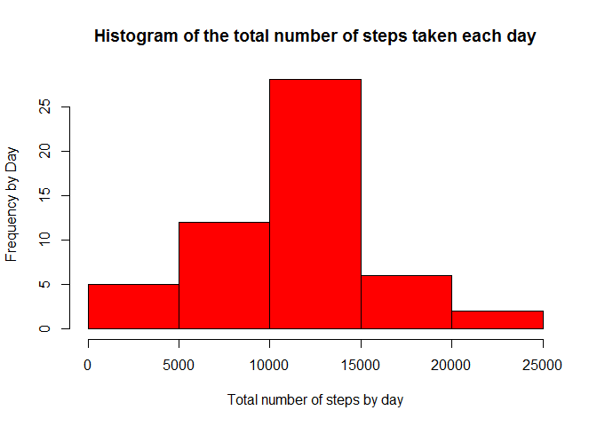
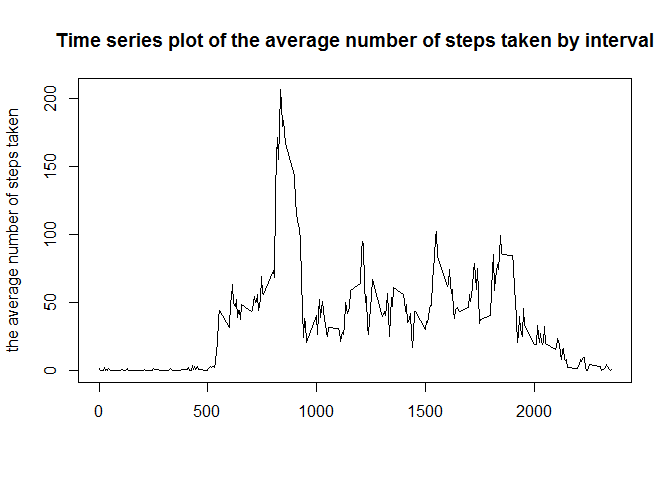
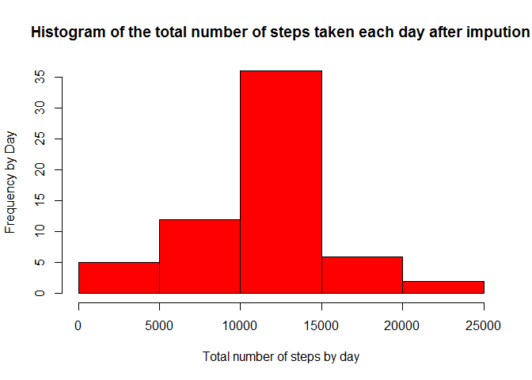

R Markdown
----------

This is an R Markdown document. Markdown is a simple formatting syntax
for authoring HTML, PDF, and MS Word documents. For more details on
using R Markdown see <http://rmarkdown.rstudio.com>.

When you click the **Knit** button a document will be generated that
includes both content as well as the output of any embedded R code
chunks within the document. You can embed an R code chunk like this:

Loading and preprocessing the data
----------------------------------

1.  data will be read from
    D:/RProjects/Module5Study/Assignment1/activity.csv

<!-- -->

    library(data.table)

    ## Warning: package 'data.table' was built under R version 3.2.5

    setwd("D:/RProjects/Module5Study/Assignment1/")
    activity <- data.table(read.csv("activity.csv"))

2a. transform date as character class into Date as Date class

    activity$date <- as.Date(activity$date, format="%Y-%m-%d")
    str(activity)

    ## Classes 'data.table' and 'data.frame':   17568 obs. of  3 variables:
    ##  $ steps   : int  NA NA NA NA NA NA NA NA NA NA ...
    ##  $ date    : Date, format: "2012-10-01" "2012-10-01" ...
    ##  $ interval: int  0 5 10 15 20 25 30 35 40 45 ...
    ##  - attr(*, ".internal.selfref")=<externalptr>

What is mean total number of steps taken per day?
-------------------------------------------------

1.  Calculate the total number of steps taken per day

<!-- -->

    stepByDate <- activity[,sum(steps),by=date]

1.  Make a histogram of the total number of steps taken each day

<!-- -->

    hist(stepByDate$V1,col = "red",main = "Histogram of the total number of steps taken each day",xlab="Total number of steps by day", ylab="Frequency by Day")

1.  Calculate and report the mean and median of the total number of
    steps taken per day

<!-- -->

    mean <- mean(stepByDate$V1,na.rm = T)
    median <- median(stepByDate$V1,na.rm = T)
    cat(paste("The Mean and median number of steps taken each day are ", 
              mean, " and ", median, " respectively."))

    ## The Mean and median number of steps taken each day are  10766.1886792453  and  10765  respectively.

What is the average daily activity pattern?
-------------------------------------------

1.  Make a time series plot (i.e. type = "l") of the 5-minute
    interval (x-axis) and the average number of steps taken, averaged
    across all days (y-axis)

<!-- -->

    avrstepByInterval <- activity[,mean(steps,na.rm = T),by=interval]
    plot(avrstepByInterval$interval,avrstepByInterval$V1,ylab='the average number of steps taken', xlab='', type='l', main = "Time series plot of the average number of steps taken by interval")

1.  Which 5-minute interval, on average across all the days in the
    dataset, contains the maximum number of steps?

<!-- -->

    maxStep <- avrstepByInterval[which.max(avrstepByInterval$V1)]$interval
    cat(paste("the maximum number of steps Which 5-minute interval, on average across all the days in the dataset is ",maxStep,"."))

    ## the maximum number of steps Which 5-minute interval, on average across all the days in the dataset is  835 .

Imputing missing values
-----------------------

1.  Calculate and report the total number of missing values in the
    dataset (i.e. the total number of rows with NAs)

<!-- -->

    incompleteR = nrow(activity[complete.cases(activity) == F,])
    cat(paste("the total number of missing values in the dataset is ",incompleteR,"."))

    ## the total number of missing values in the dataset is  2304 .

1.  Devise a strategy for filling in all of the missing values in
    the dataset. The strategy does not need to be sophisticated. For
    example, you could use the mean/median for that day, or the mean for
    that 5-minute interval, etc.

<!-- -->

    avrstepByInterval <- activity[,mean(steps,na.rm = T),by=interval]

we will use the mean for that 5-minute interval to fiil in the missing
values in the dataset.

1.  Create a new dataset that is equal to the original dataset but with
    the missing data filled in.

<!-- -->

    newActivity <- merge(activity, avrstepByInterval, by = c("interval"),sort = F)
    newActivity$steps[is.na(newActivity$steps)] <- newActivity$V1

    ## Warning in newActivity$steps[is.na(newActivity$steps)] <- newActivity$V1:
    ## number of items to replace is not a multiple of replacement length

    incompleteR = nrow(newActivity[complete.cases(newActivity) == F,])
    cat(paste("the total number of missing values in the dataset after impution is ",incompleteR,"."))

    ## the total number of missing values in the dataset after impution is  0 .

4a. Make a histogram of the total number of steps taken each day and
Calculate and report the mean and median total number of steps taken per
day.

Calculate the total number of steps taken per day

    stepByDate <- newActivity[,sum(steps),by=date]

Make a histogram of the total number of steps taken each day

    hist(stepByDate$V1,col = "red",main = "Histogram of the total number of steps taken each day after impution",xlab="Total number of steps by day", ylab="Frequency by Day")

Calculate and report the mean and median of the total number of steps
taken per day

    mean <- mean(stepByDate$V1,na.rm = T)
    median <- median(stepByDate$V1,na.rm = T)
    cat(paste("The Mean and median number of steps taken each day after impution are ", mean, " and ", median, " respectively."))

    ## The Mean and median number of steps taken each day after impution are  10766.1886792453  and  10766.1886792453  respectively.

4b. Do these values differ from the estimates from the first part of the
assignment? Based on the histogram, the data are extended vertically.

4c. What is the impact of imputing missing data on the estimates of the
total daily number of steps? Based on the histogram, the median are
skwed toward mean.

Are there differences in activity patterns between weekdays and weekends?
-------------------------------------------------------------------------

1.  Create a new factor variable in the dataset with two levels -
    "weekday" and "weekend" indicating whether a given date is a weekday
    or weekend day.

<!-- -->

    newActivity$dayofweek <- weekdays(newActivity$date)
    newActivity$dayofweek[newActivity$dayofweek == "Saturday" | newActivity$dayofweek == "Sunday"] <- "weekend"
    newActivity$dayofweek[newActivity$dayofweek != "weekend"] <- "weekday"
    newActivity$dayofweek <- as.factor(newActivity$dayofweek)

    str(newActivity)

    ## Classes 'data.table' and 'data.frame':   17568 obs. of  5 variables:
    ##  $ interval : int  0 5 10 15 20 25 30 35 40 45 ...
    ##  $ steps    : num  1.717 0.3396 0.1321 0.1509 0.0755 ...
    ##  $ date     : Date, format: "2012-10-01" "2012-10-01" ...
    ##  $ V1       : num  1.717 0.3396 0.1321 0.1509 0.0755 ...
    ##  $ dayofweek: Factor w/ 2 levels "weekday","weekend": 1 1 1 1 1 1 1 1 1 1 ...
    ##  - attr(*, ".internal.selfref")=<externalptr>

1.  Make a panel plot containing a time series plot (i.e. type = "l") of
    the 5-minute interval (x-axis) and the average number of steps
    taken, averaged across all weekday days or weekend days (y-axis).
    See the README file in the GitHub repository to see an example of
    what this plot should look like using simulated data.

<!-- -->

    avrstepByIntervalDayofweek <- newActivity[,mean(steps,na.rm = T),by=list(interval,dayofweek)]
    plot(avrstepByInterval$interval,avrstepByInterval$V1,ylab='the average number of steps taken', xlab='', type='l', main = "Time series plot of the average number of steps taken by interval")

    library(lattice)

    xyplot(V1 ~ interval | dayofweek, data = avrstepByIntervalDayofweek, type = "l", lwd = 2, layout = c(1, 2), ylab = "Number of steps")

